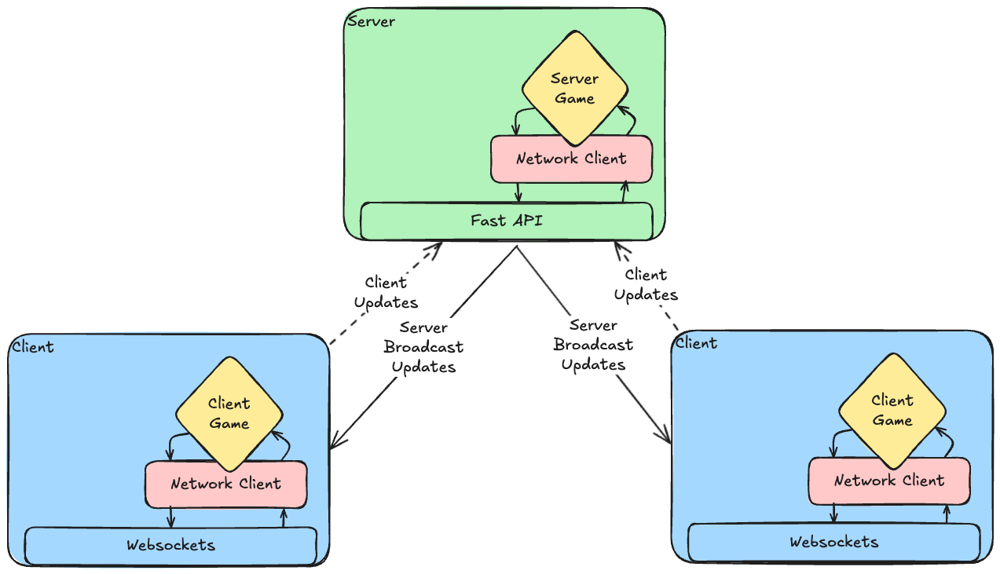

# V2 Client/Server Overview

V2 attempt to have more well defined boundaries and architecture to make
reasoning about the system easier.  This is done by abstracting the
network calls to/from the game into a Network Client which can do nothing
(for simpler debugging running) or it can actually send network packets.
Separate os threads are not used for this-- python's asyncio library is
used.  This allows for processing network events and rendering game
frames without blocking the main thread to a level where it freezes
the game or websocket messaging.

# V2 Architecture Diagram

This is a general diagram of the architecture.  The main point is that
events recevied by the server are passed into the Network Client, which
then processes them in the game, then they are sent back out through the
Network Client to the Fast API websocket, which sends them over to the 
clients.  The clients follow this same sort approach of having the 
network events go in and out through the Network Client and processing
the game events in the actual game itself.